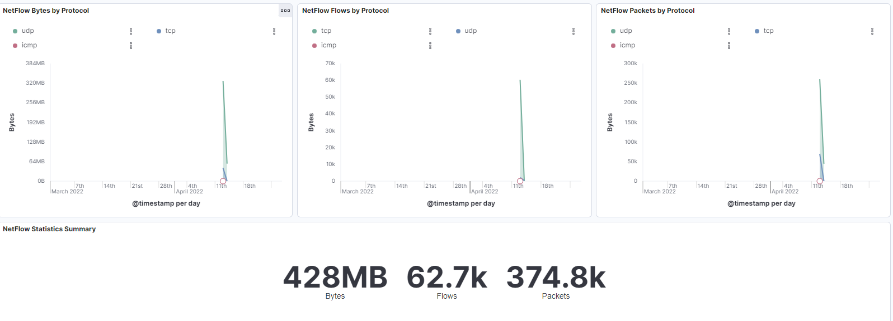
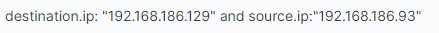
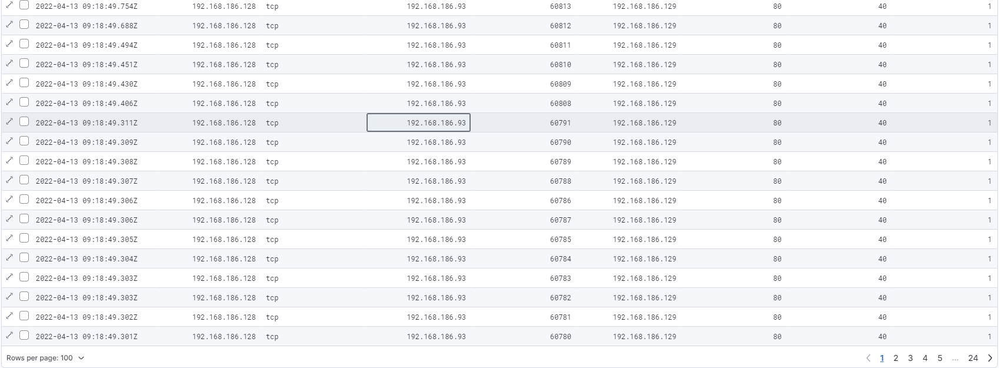

# 2.3

## 1

imported the data into SOF-ELK.

## 2

I started out by filtering normal traffic like traffic on port 53, 80 and 443.

Then i realised there was alot of traffic on ip address `192.168.186.129` so i focused in on that

Looks like source ip `192.168.186.93` have sent 2.3k packages, which is exactly the same size and the
source port is only changin by 1 for every packet and the destination port is `80` on all of them

filtering out port 80 and removing the filter on the previous attacker ip port, it seems like an address has used alot of different ports. `192.168.186.131` has used ports like `1, 13, 21, 22` and so on, seems weird.

Filtering on that ip it seems like that ip has contacted ports from 1-61532.

## CASE CLOSED!
