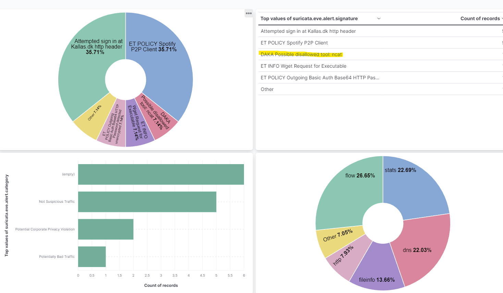
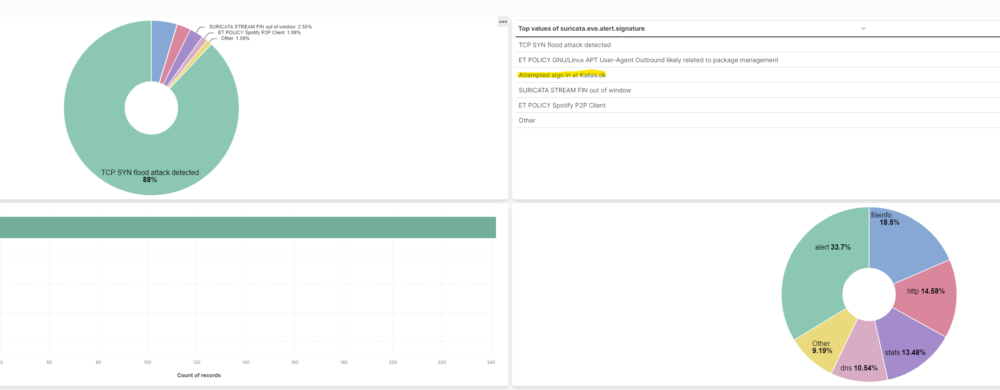
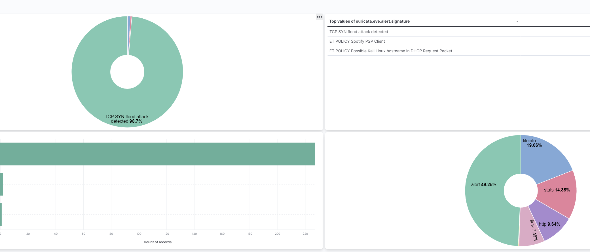

# 2.4 Suricata rules

## 1

`alert http any any -> any any (msg:"DABE Possible disallowed tool: ncat"; content:"ncat.exe"; http_uri; nocase; sid:7000003; rev:2;)`

this rule checks if any ip from any source chceks if the payload of an HTTP packet has ncat.exe in it and gives a warning.

## 2

`alert http $HOME_NET any -> 165.232.77.195 any (msg:"Homenet attempted login to kallas.dk";http_method; content:"GET";http.header; content:"Authorization"; sid:7000004; rev:1;)
`

this rule checks if any from the home net tries to sign in at at kallas.dk, it checks if its a GET request and /basic.php to check if the user is activevly trying to sign in. Flow just adds more direction to the rule and looks for a flow to the server.

## 3

`alert tcp any any -> 192.168.238.2 any (msg:"TCP SYN flood attack detected"; flags:S; threshold: type threshold, track by_dst, count 20 , seconds 60; classtype:denial-of-service;priority:5 ;sid: 7000100; rev:1;)
`

This is the original rule. The idea of this rule is to check if anyone sends SYN packages to my router by over 20 packages in 60 seconds.

for it to work i have made some changes.

`alert tcp any any -> 192.168.106.2/24 any (msg:"TCP SYN flood attack detected"; tcp.flags:S; threshold: type threshold, track by_dst, count 20 , seconds 60; classtype:denial-of-service;priority:5 ;sid: 7000100; rev:3;)
`

I have changed the `flags` to be `tcp.flags` as per suricata documentation. I of course also made the ip address actually hit my IP range.

